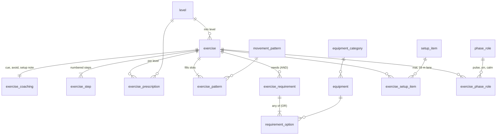
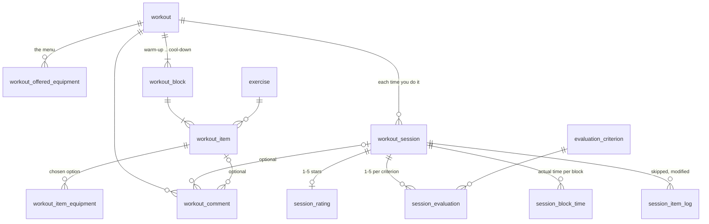

# Database design

The schema is in [`db/schema.sql`](../db/schema.sql). It targets **SQLite 3.44+** (STRICT tables, `group_concat ... ORDER BY`) for a single user. The database, `db/workouts.db`, is the only source of data the app uses, and is tracked in git. It has two halves:

1. **Catalogue**: exercises and everything that describes them. It was seeded once from `db/seed/exercises.json` (`tools/db_import.py`); that file is kept only as a historical snapshot, and the catalogue is edited in the database.
2. **Workouts**: generated workouts, each time you do one, and how it went: rating, evaluation, comments, and actual vs estimated time.

> SQLite turns foreign keys **off** by default. Every connection must run `PRAGMA foreign_keys = ON;`, or none of the integrity rules below are enforced.

## Catalogue



| Table | Holds | Why it's separate |
|---|---|---|
| `exercise` | Identity (`slug`, `name`), minimum level, hold time for timed moves, and the flags the generator filters on (`is_combo`, `is_sprint`, `is_partner`, ...) | The core table stays narrow: every generator query touches it, so it holds only what filtering needs |
| `exercise_coaching` | `cue`, `avoid`, `setup_note` (1:1) | Text for people; the generator never reads it |
| `exercise_step` | Numbered instruction steps | A list, so one row per step |
| `exercise_prescription` | What to do per level: text plus a parsed `hold_seconds` and `per_side` | The JSON's "use the last value" rule is expanded when loading, so a lookup is a primary-key hit. The parsed hold time drives the follow-along timer without regex |
| `movement_pattern` | Slots: squat, hinge, plyoL, warm, ... with `is_timed` and `is_explosive` | Behaviour that was hardcoded in `app.js` (which patterns are timed, which get the Plyo tag) becomes data |
| `exercise_pattern` | Which slots an exercise fills; one is primary | Replaces `pattern` + `also_pattern`. A partial unique index allows exactly one primary |
| `exercise_requirement` + `requirement_option` | Equipment as **AND of ORs**: `["box\|bench", "db"]` is two requirements, the first with two options. `preference` keeps the options' order, since the first is the preferred one | The only normalised form of "either one works" that keeps referential integrity. No `"db\|kb"` strings in the database |
| `equipment`, `equipment_category` | 24 items in 4 groups | Categories give the settings screen headings |
| `setup_item` + `exercise_setup_item` | "Clear 15 m lane", "Mat", ... | 48 distinct items linked 246 times, instead of repeated text |
| `level` | Beginner to Beast, **with rest times and rounds** | These were constants in `app.js` (`RESTS`); they belong to the level |
| `phase_role` + `exercise_phase_role` | Warm-up and cool-down roles: pulse, flow, mobility, stretch, yin, calm | Replaces the hardcoded id lists in `generate()` |
| `figure_pose` | Named, reusable poses for the movement drawings ("stand", "plank-top", ...), as JSON | Most drawings only name a pose, so shared positions are written once |
| `exercise_figure` | The 2-4 key drawings of an exercise, each covering a run of steps (`first_step`..`last_step`), with the scene as JSON | See "Movement drawings" below |

### Where performance won over normal form

- **Flags as columns, not a tag table.** `is_combo`, `is_sprint` and the other flags are fixed, yes/no, and read by every generator query. As columns, filtering needs no join. A generic tag table would still suit open-ended labels later.
- **Prescriptions expanded per level.** Storing a row for every level the exercise supports (2,396 rows) repeats some text. In return, "what do I do at Advanced?" is a single primary-key lookup, with no fallback logic in SQL.
- **`WITHOUT ROWID`** on pure link tables (`exercise_pattern`, `requirement_option`, ...). The composite primary key *is* the table, so there's no second structure to maintain.
- **Covering indexes** in both directions on the link tables, such as `requirement_option (equipment_id, requirement_id)`, so "which exercises use a sledgehammer?" doesn't scan.

### The generator's main query

It finds candidates for one slot: the right pattern, the level allows it, the partner and sprint settings allow it, and every equipment requirement has at least one option you offered. That last part is a double `NOT EXISTS`, and it runs entirely on indexes:

```sql
SELECT e.slug
FROM exercise e
JOIN exercise_pattern ep ON ep.exercise_id = e.exercise_id
JOIN movement_pattern p  ON p.pattern_id = ep.pattern_id AND p.code = :pattern
WHERE e.is_active = 1
  AND coalesce(e.min_level_id, 1) <= :level
  AND (e.is_partner = 0 OR :partner = 1)
  AND (e.is_sprint = 0 OR :sprints <> 'none')
  AND NOT EXISTS (                                   -- no requirement is left unmet
        SELECT 1 FROM exercise_requirement r
        WHERE r.exercise_id = e.exercise_id
          AND NOT EXISTS (
                SELECT 1 FROM requirement_option o
                JOIN equipment q ON q.equipment_id = o.equipment_id
                WHERE o.requirement_id = r.requirement_id
                  AND q.code IN (SELECT value FROM json_each(:offered))));
```

## Workouts



| Table | Holds |
|---|---|
| `workout` | The name you gave it when saving, the settings it was generated with (level, hard-work time, plyo, sprint, combo, course, grip, partner), the **estimated time snapshot**, generator version, favourite flag |
| `workout_offered_equipment` | The equipment you *offered*: the menu, not what was used |
| `workout_block` | Warm-up, course, blocks A-F, grip finisher and cool-down, in order, with rounds and rest times |
| `workout_item` | One exercise in a block, with a **snapshot** of its prescription and time estimate |
| `workout_item_equipment` | Which option was used ("box", not "bench"). The kit, "What you'll need", is derived from this in `v_workout_kit`, so it's never stored twice |
| `workout_session` | One attempt: start, finish, active seconds (pauses excluded), completed, and "felt too short / about right / too long" |
| `session_block_time` | Actual seconds per block, from the follow-along timer |
| `session_item_log` | Items skipped or modified, with a note ("knee felt off") |
| `session_rating` | **Rating**: overall 1-5 stars, one per session |
| `evaluation_criterion` + `session_evaluation` | **Evaluation**: a 1-5 score per criterion. It ships with difficulty, enjoyment, variety, flow and fit to goals; new criteria are rows, not schema changes |
| `workout_comment` | **Comments**: on the workout, and optionally on a specific session and/or exercise ("swap this one next time") |

**Rating and evaluation belong to a session, not a workout.** You can do the same workout twice and rate it differently; `v_workout_summary` averages them.

**Snapshots in `workout_item` are deliberate.** They're the one place where values are copied instead of referenced. If an exercise's prescription is edited next month, last month's workout must still show what you actually did. The link to `exercise` stays, so statistics still work.

**Exercises are never deleted.** `workout_item → exercise` is `ON DELETE RESTRICT`, so an exercise used in any workout can't be deleted; set `is_active = 0` to retire it. Workouts, however, delete cleanly: everything under them cascades.

### Integrity beyond foreign keys

Foreign keys can't express "this must belong to the same workout". Triggers cover that:

- `trg_comment_same_workout`: a comment's session and item must belong to its workout.
- `trg_block_time_same_workout`, `trg_item_log_same_workout`: session data must refer to that session's workout.
- `trg_item_equipment_is_option`: the chosen equipment must be one of the exercise's options.

`CHECK` constraints cover ranges and enums: stars and scores 1-5, block counts 1-6, `finished_at >= started_at`, and so on.

### Views

| View | Answers |
|---|---|
| `v_exercise_card` | Everything the app shows for an exercise, flattened |
| `v_workout_kit` | "What you'll need" for a workout |
| `v_session_time` | Estimated vs actual per session: delta in seconds and percent, plus how it felt |
| `v_block_time` | The same per block, to see *which part* runs long |
| `v_workout_summary` | Per workout: sessions, average stars, average actual time, comment count |
| `v_exercise_stats` | Per exercise: how often generated, how often skipped, average rating of workouts it was in |

### Movement drawings

Each exercise can have a few drawings, each illustrating one or more of its steps. A drawing's `scene` is JSON: a list of items such as figures (a pose name, optionally shifted with `x`/`y` or with some keys overridden), equipment (plate, kettlebell, box, rack, pull-up bar, landmine), arrows, guide lines and labels, or a top view for obstacle courses. The drawing code is the `FIG` section of `web/js/app.js`, which documents the coordinates and pose keys.

The scene is stored as one JSON value, not spread over tables, because it is only ever read whole and drawn; nothing queries parts of it. `json_valid()` keeps malformed JSON out, and `tools/validate.py` checks the rest: poses exist and are well formed, items are known, and an exercise's drawings cover its steps in order, each step exactly once. Add or change drawings with `tools/figures.py put`, which validates before committing. The tables were added by `db/migrations/001_figures.sql`.

## How the app reads the catalogue

`api.catalog()` flattens the catalogue tables into one JSON document: `GET /api/catalog` serves it, and `tools/build.py` inlines it into the single-file build. It keeps the readable field names of the old JSON (`pattern`, `equipment` as `"db|kb"` strings, `reps` per level, ...), plus `levels` (names, rest times, rounds), `criteria` (evaluation criteria), `phases` (warm-up and cool-down roles to exercise ids), `poses` (pose code to pose) and `figures` (exercise id to its drawings, each `{"steps": [first, last], "scene": {...}}`). `tools/validate.py` checks the same document.

## Verified against the real data

The schema was checked when the catalogue was seeded from `exercises.json`, with all constraints on:
- **Catalogue:** all 896 exercises, 3,470 steps, 775 equipment requirements and 48 setup items. Exporting it back gives the JSON's content field for field (short `reps` lists come back expanded to all four levels, which the app reads the same way), along with the six warm-up and cool-down lists.
- **Candidate query:** returns exactly the same exercises as the app's `ok()` filter for every setting and slot tested.
- **Workouts:**
  - A generated workout was stored in full, and `v_workout_kit` produced the same equipment list as the app.
  - A session with a rating, evaluation, block times, a skipped item and comments was stored.
  - Ten kinds of bad write were all rejected, and deleting the workout cascaded completely.

## Adding more people later

The schema assumes one user. To support several, add a `person` table and a `person_id` foreign key to `workout`, `workout_session` and `workout_comment`. If partners should rate the same session separately, change the primary keys of `session_rating` and `session_evaluation` to include `person_id`. No other table changes.
